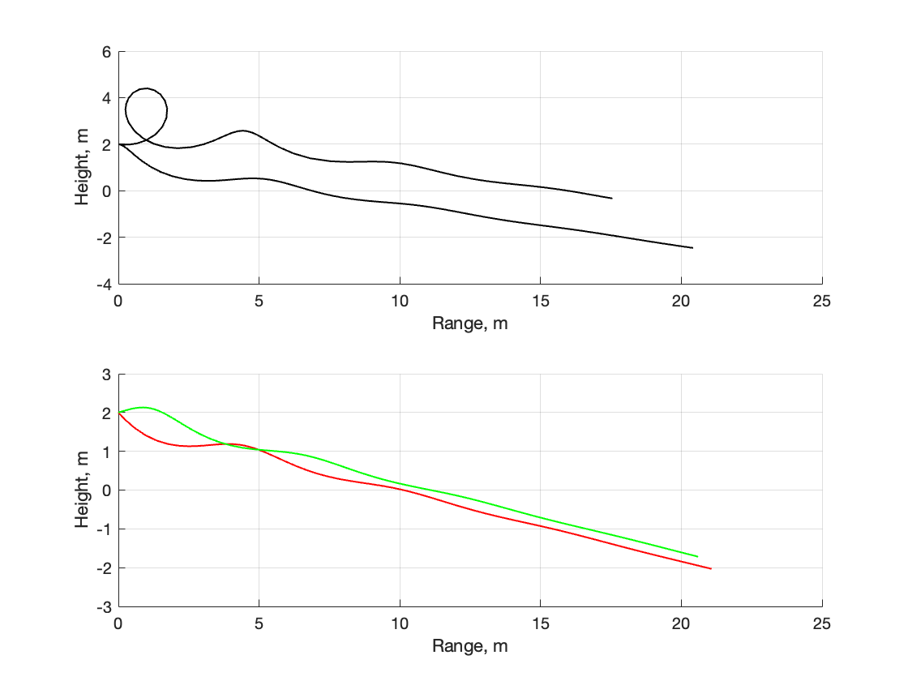
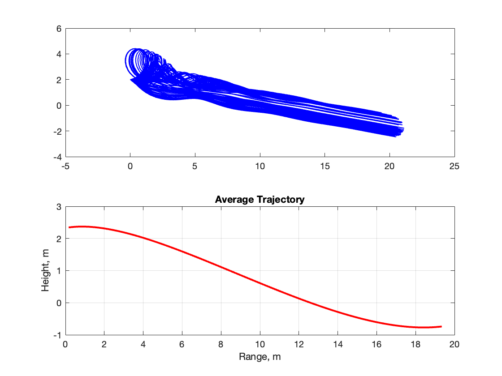
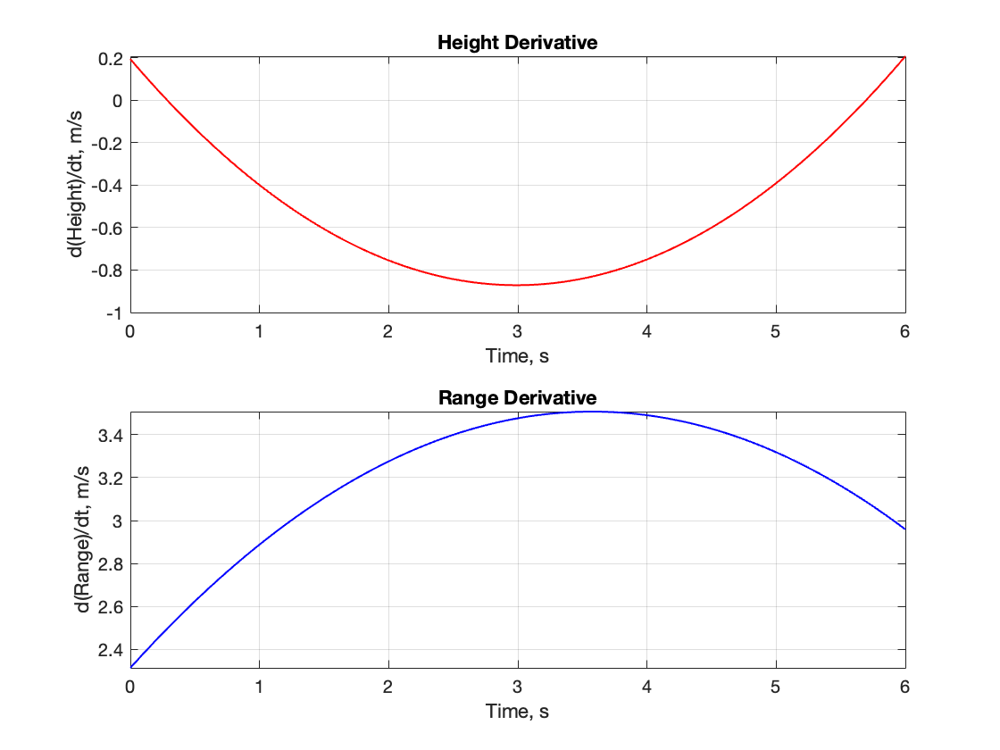

# Paper Airplane Numerical Study
Final Project: AEM 3103 Spring 2024

- By: Lucas Powers

## Summary of Findings

| Parameter Variation    | Lower Bound | Nominal Value | Upper Bound |
|------------------------|-------------|---------------|-------------|
| Initial Velocity (m/s) | 1.55        | 3.55          | 11.05       |
| Initial Flight Path Angle (rad) | -0.68 | -0.18         | 0.22        |

In this project, I experimented with the flight dynamics of a paper airplane with varying parameters. The varying parameters include differences in initial velocity and differences in the flight path angle of the paper plane. From my calculations, I can state that an increase in the initial velocity resulted in longer-range flights, higher flight path angles led to steeper descent trajectories, and that the Monte Carlo simulation was able to demonstrate a wide range of possible trajectories due to parameter variations and limits.

# Code Listing

- [EqMotion.m](EqMotion.m)
  - This function calculates the first-order time derivative of the state variables, which describe the motion of the aircraft over time.

- [paper_plane.m](paper_plane.m)
  - This script declares the global variables of the paper plane and analyzes its behavior with varying parameters. 
# Figures

## Fig. 1: Single Parameter Variation

This figure illustrates how varying a single parameter affects the nominal flight trajectory of the paper airplane. The plots show the trajectory in the height vs. range space, with each line representing a different parameter variation scenario. For example, when varying the initial velocity, higher velocities result in longer ranges and higher altitudes due to increased kinetic energy. Conversely, lower velocities lead to shorter ranges and lower altitudes. Similarly, varying the flight path angle alters the trajectory's steepness, with higher angles resulting in steeper descents and lower angles leading to shallower descents. In these figures the nominal trajectory is displayed in black, the lower nominal trajectory is red and the higher nominal trajectory is green.

## Fig. 2: Monte Carlo Simulation

In this figure, the results of a Monte Carlo simulation are presented, showcasing the variability in paper airplane trajectories under 100 random parameter variations. Each line represents a trajectory obtained from a different combination of randomly sampled parameters. The spread of trajectories demonstrates the potential range of flight paths achievable under random parameters. The second graph demonstrates the average of all of the 100 random trajectories.

## Fig. 3: Time Derivatives

This figure displays the time derivatives of height and range for the average trajectory obtained from the Monte Carlo simulation. The curves represent the rates of change of height and range over time, providing insights into the paper airplane's ascent and descent dynamics. Key points on the curves, such as the peaks or valleys, correspond to major events during the flight, such as maximum altitude, and minimum altitude. 

  
